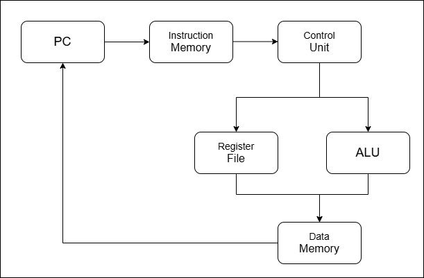
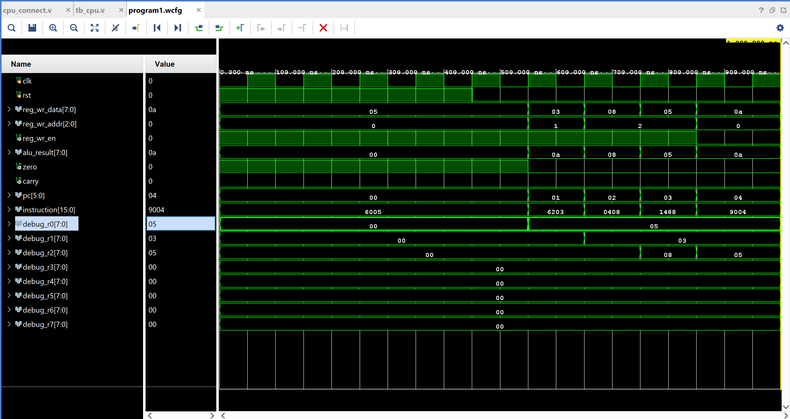
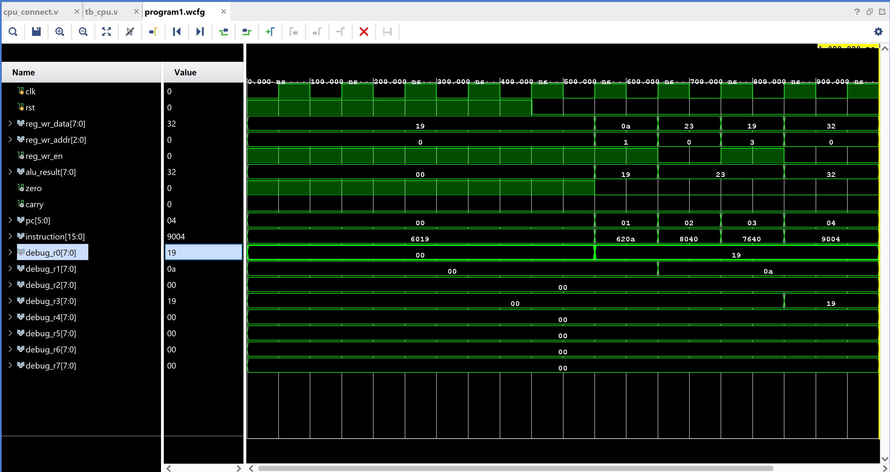
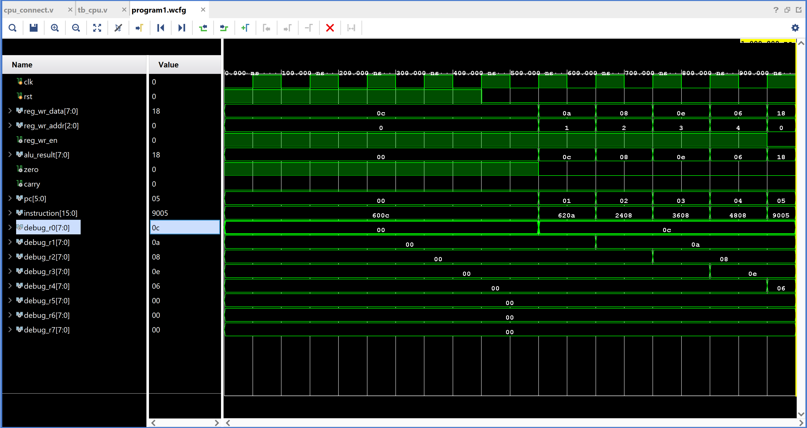

# 8-bit RISC Processor — Verilog

A simple 8-bit RISC (Reduced Instruction Set Computer) processor
implemented from scratch in Verilog and verified on Xilinx Vivado XSim.
Includes a custom Python assembler that converts assembly language
to machine code automatically.

## Author
Anjali Vemula  
B.Tech ECE — MANIT Bhopal  
2024-2028  

## Block Diagram



## Modules

| Module | Description |
|--------|-------------|
| alu.v | Arithmetic Logic Unit — ADD SUB AND OR XOR NOT |
| register_file.v | 8 registers R0-R7 each 8 bits wide |
| program_counter.v | Tracks current instruction address |
| instruction_memory.v | Stores program loaded from program.mem |
| data_memory.v | 64 byte data storage for LOAD STORE |
| control_unit.v | Decodes instructions generates control signals |
| cpu_connect.v | Top level connecting all modules |

## Instruction Set

| Opcode | Instruction | Operation |
|--------|-------------|-----------|
| 0000 | ADD rd rs1 rs2 | rd = rs1 + rs2 |
| 0001 | SUB rd rs1 rs2 | rd = rs1 - rs2 |
| 0010 | AND rd rs1 rs2 | rd = rs1 AND rs2 |
| 0011 | OR rd rs1 rs2 | rd = rs1 OR rs2 |
| 0100 | XOR rd rs1 rs2 | rd = rs1 XOR rs2 |
| 0101 | NOT rd rs1 | rd = NOT rs1 |
| 0110 | MOV rd imm | rd = immediate (0-511) |
| 0111 | LOAD rd rs1 | rd = Memory[rs1] |
| 1000 | STORE rs1 rs2 | Memory[rs1] = rs2 |
| 1001 | JMP addr | PC = addr |
| 1010 | BEQ rd addr | if rd==0 then PC = addr |

## Instruction Format — 16 bits

```
[15:12] opcode   4 bits
[11:9]  rd       3 bits  destination register
[8:6]   rs1      3 bits  source register 1
[5:3]   rs2      3 bits  source register 2
[8:0]   imm      9 bits  immediate (MOV only)
[5:0]   addr     6 bits  jump address (JMP BEQ only)
```

## How to Write and Run a Program

### Step 1 — Write assembly in program.asm

```
MOV R0 5        # R0 = 5
MOV R1 3        # R1 = 3
ADD R2 R0 R1    # R2 = R0 + R1 = 8
SUB R2 R2 R1    # R2 = R2 - R1 = 5
JMP 4           # halt
```

### Step 2 — Run the assembler

```bash
cd assembler
python assembler.py
```

### Step 3 — Output program.mem is generated automatically

```
6005
6203
0408
1488
9004
```

### Step 4 — Simulate in Vivado

```
1. Open Vivado project
2. Copy program.mem to simulation folder
3. Run Behavioral Simulation
4. Run for 10us
5. Check waveform and console output
```

## Sample Programs

### Program 1 — Basic arithmetic

```
MOV R0 5
MOV R1 3
ADD R2 R0 R1
SUB R2 R2 R1
JMP 4
```

Expected: R0=5 R1=3 R2=5

### Program 2 — Store and Load

```
MOV R0 25
MOV R1 10
STORE R1 R0
LOAD R3 R1
JMP 4
```

Expected: R0=25 R3=25 (loaded from memory address 10)

### Program 3 — Logic operations

```
MOV R0 12
MOV R1 10
AND R2 R0 R1
OR R3 R0 R1
XOR R4 R0 R1
JMP 5
```

Expected: R2=8 R3=14 R4=6

## Simulation Results





## Tools Used

- Xilinx Vivado 2025.2
- Verilog HDL
- XSim Simulator
- Python 3 (assembler)

## What I Learned

- CPU datapath design
- Control unit and instruction decoding
- Register file and ALU design
- Assembly language and assembler implementation
- How instructions execute in hardware
- Memory read and write operations
- Finite state machine design in Verilog

## Related Projects

- [UART Transceiver](https://github.com/YOUR_USERNAME/uart-verilog)
- [SPI Controller](https://github.com/YOUR_USERNAME/spi-controller)
